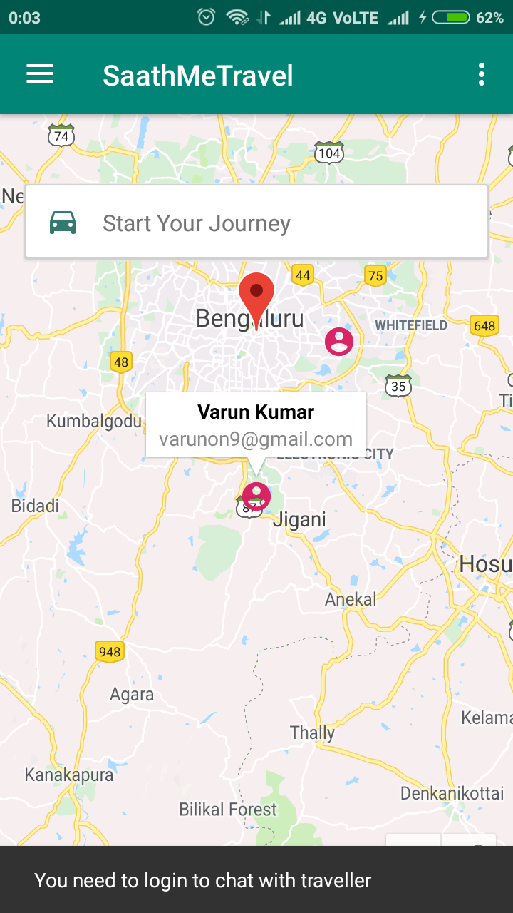
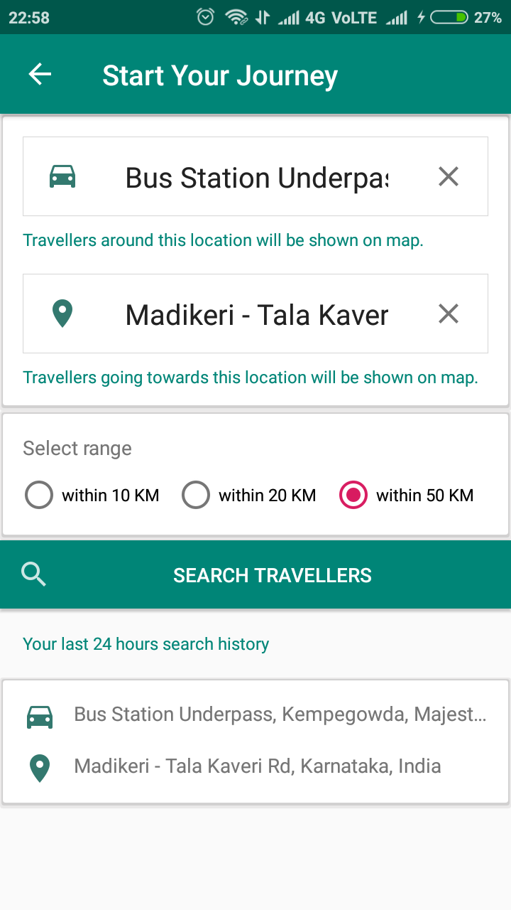
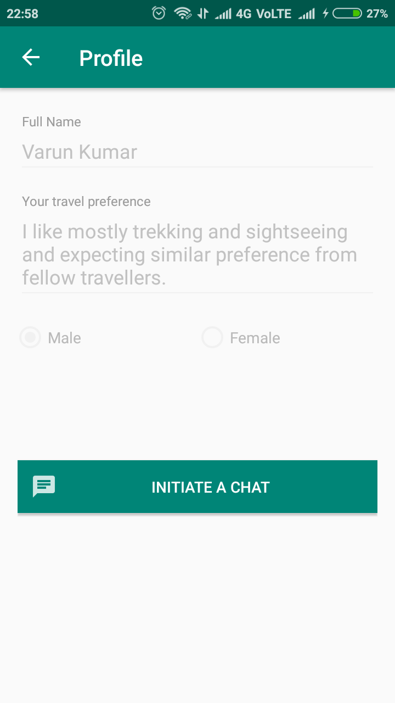
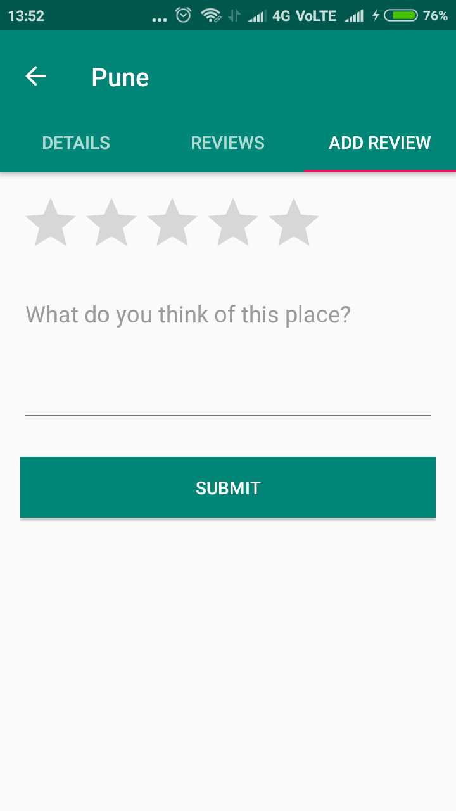
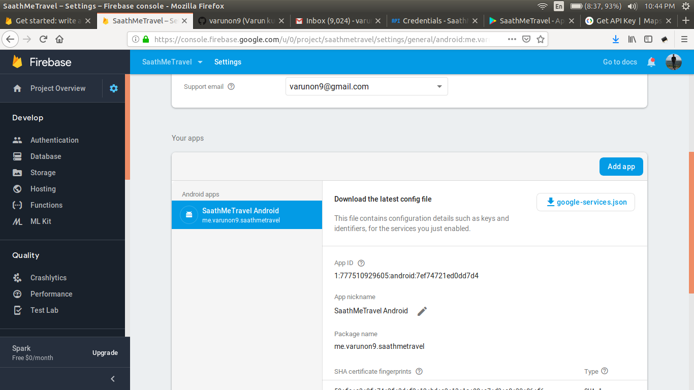

# SaathMeTravel

SaathMeTravel is a platform where you can plan for a journey i.e. setting your travel source and destination and then you will be matched to other travellers who are also looking for similar travel plan.
You can take ideas from them, discuss plannings or even travel together.

### A typical flow

1. You come to SaathMeTravel app.
2. You see nearby travellers on map. 
3. You plan for a journey e.g. from Bangalore to Coorg.
4. You will be matched to other fellow travellers planning similar journey.
5. You can chat with them to share ideas and discuss plannings.
6. You can get details about Bangalore, ratings and reviews etc.

### Android app link

### Screenshots
|  |  |
| --- | --- |
| | |
| | |
| | |

### Setting the project in AndroidStudio

1. Clone the project/download zip
2. Import it in AndroidStudio
3. Add `SAATHMETRAVEL_GOOGLE_MAPS_API_KEY=AIza...` in `~/.gradle/gradle.properties` file (inside home folder)
4. Replace Aiza... with your google map api key. You can get it from https://developers.google.com/maps/documentation/android-sdk/signup
5. Create an android firebase project https://console.firebase.google.com and put `google-services.json` file inside app directory

6. You need to enable firebase-auth, firebase-firestore, firebase-messaging, firebase-crashlytics and firebase-remote-config in your project.
7. Build and run the project

### Setting google cloud functions

When you download app and login using your email, you will receive a welcome email.
App is completely serverless and this part is implemented using google cloud functions (https://firebase.google.com/docs/functions/get-started). To deploy your own cloud functions-

1. Go to cloud-functions directory inside project `cd cd cloud-functions/`
2. Install firebase-cli globally in your machine `npm install -g firebase-tools`
3. Login to firebase ` firebase login`
4. Install dependencies `npm install`
5. Use your own gmail credentials to send emails (you can check in sent emails). To do so, configure your gmail credentials to firebase
6. `firebase functions:config:set gmail.email <you@gmail.com>`
7. `firebase functions:config:set gmail.password <your_gmail_password>`
8. Enable less secure apps in gmail https://www.google.com/settings/security/lesssecureapps
9. You might also need to enable this https://accounts.google.com/DisplayUnlockCaptcha
10. To highlight route between source and destination you need to configure a google place api key. Pass it to firebase configuration environment variable using `firebase functions:config:set google_maps.routes_places_api_key <GOOGLE_PLACE_API_KEY>`
11. You can get place api key from https://developers.google.com/places/web-service/get-api-key
12. Deploy functions `firebase deploy --only functions`
13. Try signing up using email and you will receive welcome email from your own gmail account

#### For query/issues open Github issue or contact: varunon9@gmail.com